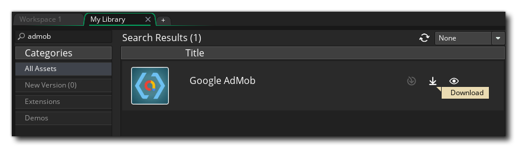
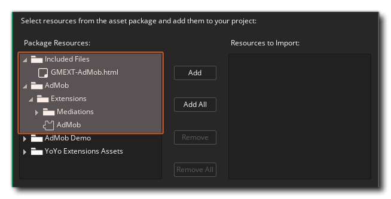
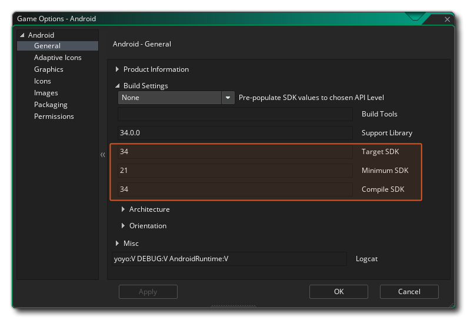
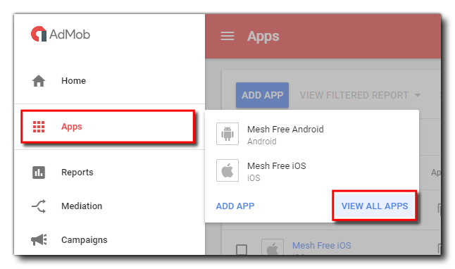

@title Setup

# Setup

While Google is primarily directed towards supporting their Android platform, they do provide the [AdMob](https://www.google.com/admob/) platform to deliver advertising to both Android *and* iOS. This article provides information on how to set up your game on the AdMob dashboard, as well as steps on how prepare it in GameMaker so that ads will be shown when the final game is played by users. This is achieved using the AdMob extension, which is to be used alongside your Google AdMob account ([web page](https://admob.google.com/home/)). All the required personal ad IDs and consent messages should be handled through there.

[[NOTE: If you have the Amazon Fire target, the setup for advertising is exactly the same as is described in this article for Android.]]

[[WARNING: To build and deploy to iOS it's required for the developer to install CocoaPods. ([installation guide](https://help.gamemaker.io/hc/en-us/articles/360008958858-iOS-and-tvOS-Using-CocoaPods))]]

If you have not already signed up for an AdMob account, you should [do this now](https://support.google.com/admob/answer/7356219?hl=en) (it's free), and also ensure that you have your game set up and running on the target platform(s). You can find setup guides from the following links:

* [Setting Up For Android](https://help.gamemaker.io/hc/en-us/articles/115001368727)
* [Setting Up For iOS](https://help.gamemaker.io/hc/en-us/articles/115001368747)

We also recommend that you read the **AdMob Implementation Guidelines**, as these outline how Google expects you to use each type of ad unit:

* [AdMob Implementation Guidelines](https://support.google.com/admob/answer/2936217?hl=en)

## Setting up AdMob (Dashboard)

### Adding Your Game

Once you have signed up and logged in to your AdMob account, you can start to add the games you want to monetise to the dashboard. When it comes to AdMob, each *version* of a game is considered an individual app, so if your project is for iOS *and* Android then you'll need to add it twice, once for each platform.

To add your game to the AdMob Dashboard, see: 

> [Set up an app in AdMob](https://support.google.com/admob/answer/9989980)

Click the **Add** button when ready and you'll be taken to the overview page where you'll be shown the **App ID** - *which you should take note of as you'll need it later* - along with options to **Create Ad Unit** or skip that step. You can add ad units at any time to an app after it has been created so if you are doing Android and iOS you may want to skip the ad unit part and instead add the other version of the game. When ready you can continue on to the section on **Creating An Ad Unit**.

### Creating An Ad Unit

Once you have added the app(s) you can then start creating ad units. There is no limit to ad units that you can add for an application, and they don't all need to be active in the same app at the same time. You can create various units with different properties and then swap the unit IDs in the game project to change which one is used (this will require a new upload of the project to the relevant stores).

To create an ad unit in the AdMob Dashboard, see: 

> [Ad units, ad formats, & ad types](https://support.google.com/admob/answer/6128738)

Once you click the **Create Ad Unit** button, the unit will be created and you can note the **Unit ID** and then click either *Done*, if you don't wish to make any other ad units, or *Create Another Ad Unit*, if you do.

### Configuring Mediation

AdMob Mediation is a feature that lets you serve ads to your apps from multiple sources, including the AdMob Network and third-party ad sources, in one place. AdMob Mediation helps maximize your fill rate and increase your monetization by sending ad requests to multiple networks to ensure you find the best available network to serve ads.

The AdMob extension package includes a few additional extensions for certain ad networks, which you can enable to use them, or remove entirely if you don't use them in your project. Most of the configuration needs to be done in the AdMob Dashboard.

For more information see the AdMob documentation:

> [Mediation Get Started](https://developers.google.com/admob/android/mediation) and [Guide to AdMob Mediation](https://support.google.com/admob/answer/13420272)

### GDPR Consent

1. For GDPR consent you should follow the options below:\
`AdMob Console` → `Privacy and Messaging` → `Go to funding choices` → `(select your project)` → `Create (new message)` → `EU Consent` → fill all the necessary details.

## Setting Up GameMaker

You can get the latest release of this extension from [GitHub](https://github.com/YoYoGames/GMEXT-AdMob/releases/latest) or alternatively get it [from the **Marketplace**](https://marketplace.gamemaker.io/assets/10078/google-admob) and add it to your account.

Once added to your account, open your library (from the Marketplace menu in GameMaker) and then search for "admob" for it to show up in the list of purchased assets and click the "**Download**" button.

To use the extension you need the "**AdMob**" group, and to read the documentation, you need the "**Included Files**" group:

You can optionally import the "**AdMob Demo**" if you want to test the provided demo. If you do, make sure to import "**YoYo Extension Assets**" as well.

Clicking the *Import* button will install it.

Once that's done you will also need to ensure that the **Minimum SDK API Level** is set to at least **21** in the **Android Game Options**, as that is the minimum required API level for the AdMob SDK to build, while the Target and Compile should be on the latest:

### Initialising AdMob

Once you have installed the extension, you are almost ready to start coding the ads into your project. However, before you start, make sure that you have the **App ID** and the various **Ad Unit ID**s as we'll need them for the code. If you didn't copy this when you created the app listing, you can easily find it by going to the AdMob dashboard and selecting the **Apps** menu option then **View All Apps**:

From the apps listings, you then simply have to click the App ID icon to copy the App ID to the clipboard:

If you are wanting to show interstitial ads, then you will *also* need your **Ad Unit ID** for the interstitial ad unit, which (if you haven't already got it copied somewhere) you can get by clicking on the app in the AdMob dashboard, and then going to **Ad Units** and clicking the **Ad Unit ID** button to copy it to the clipboard. If you do not want to use interstitial ads, then simply supply an empty string "" as the Unit ID.

If you have any other ads (banners, or rewarded) then you should take a moment to copy each of those Ad Unit IDs too.

All IDs should go in the Extension Options: 

Just replace the **Application ID** with your Google Application ID and use your personal Ad Unit IDs (for **Banners**, **Interstitial**, **Rewarded** and **Rewarded Interstitial**)

## Mediation

The AdMob extension comes with a few additional extensions that each add support for an ad network. By default, all of these are disabled and don't copy to any platform. To enable a mediation adapter extension, check Android and iOS in the **Copies To** section of the extension options. The adapter extensions for ad networks that you don't use in your project can be removed.

The above is what is needed in your project to allow mediation. Further setup takes place in the AdMob Dashboard, as explained above.